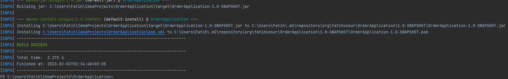
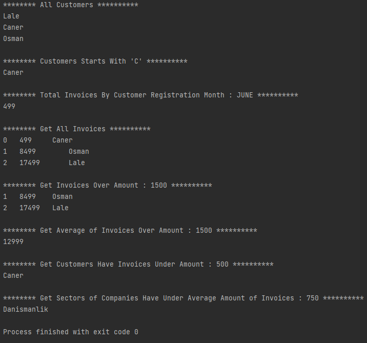

# Order Application - Patika.dev & DefineX Java Spring Practicum

## Homework - 2

An application for creating and listing orders and invoices for customers.

# Maven Commands Output



# Console Output



# Entities

Company\
Sector\
Customer\
Product\
Order\
Invoice

# Services

## Entity Service

```List<TEntity> getAll()```: returns all ```TEntity```

```TEntity getById(Long id) :``` returns ``` TEntity``` by ```id```

```TEntity add(TEntity entity)``` : adds new ```TEntity```

## Company Service

This service extends the ```Entity Service```

## Customer Service

This service extends the ```Entity Service```

```Set<Customer> getCustomersStartsWithLetter(String letter)```: returns all Customers as a Set which are names starts
with ```letter```

```List<Customer> getCustomerHaveInvoiceUnderAmount(BigDecimal amount)```: returns all Customers as a List which they
have invoice under ```amount```

## Invoice Service

This service extends the ```Entity Service```

```List<Invoice> getInvoicesOverAmount(BigDecimal amount)```: returns all Invoices as List over ```amount```

```BigDecimal getAverageOfInvoicesOverAmount(BigDecimal amount)```: returns average of Invoices over ```amount```

```BigDecimal getTotalInvoicesByCustomerRegistrationMonth(Month month)```: returns total amount of Invoices by Customer
registration ```month```

## Order Service

This service extends the ```Entity Service```

## Product Service

This service extends the ```Entity Service```

## Sector Service

This service extends the ```Entity Service```

```Set<Sector> getSectorOfCompaniesHaveInvoicesUnderAverageAmount(BigDecimal amount)```: returns Sectors of Companies
Have Invoices Under Average ```amount``` as a Set

